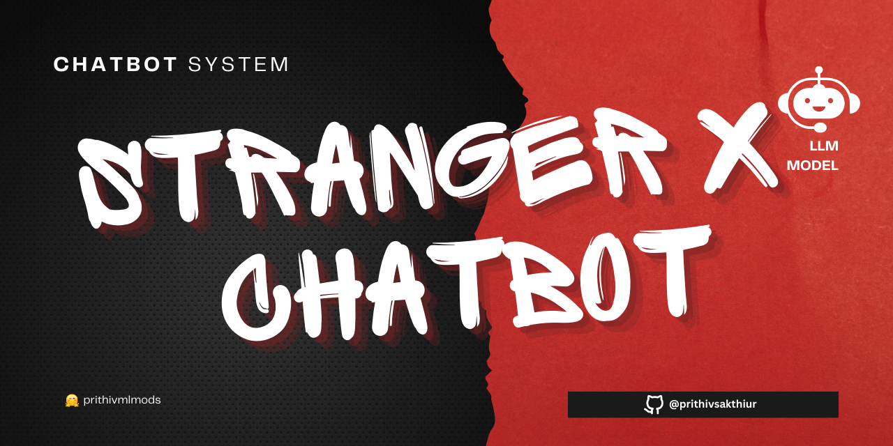
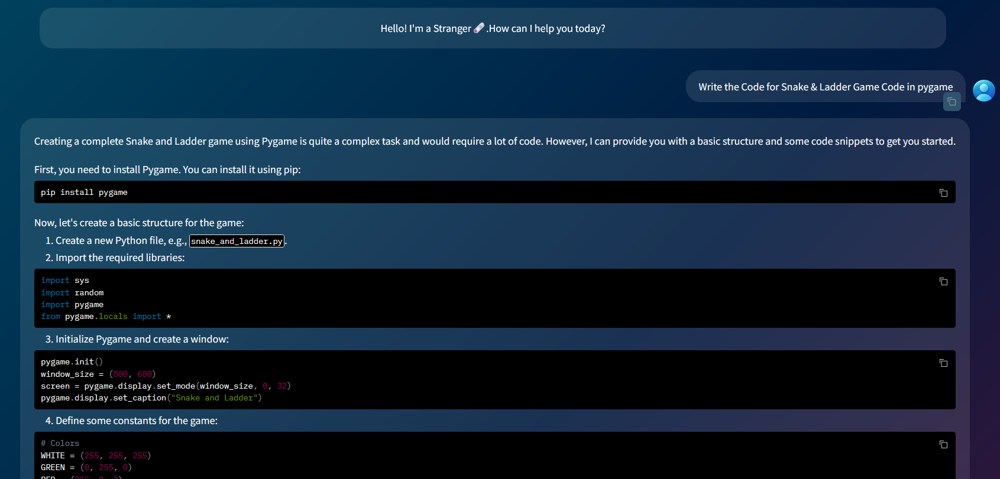

🚀Check out the configuration reference at : https://huggingface.co/docs/hub/spaces-config-reference

🚀Huggingface space : https://huggingface.co/spaces/prithivMLmods/StrangerAI-Thunder-ChatBot

🚀The GitHub Model Workspace : git clone https://huggingface.co/spaces/prithivMLmods/StrangerAI-Thunder-ChatBot

ℹ️Generated Result in Huggingface Spaces:

## 🔮The Prompt Give to the AI Model 

.

.

.

.

